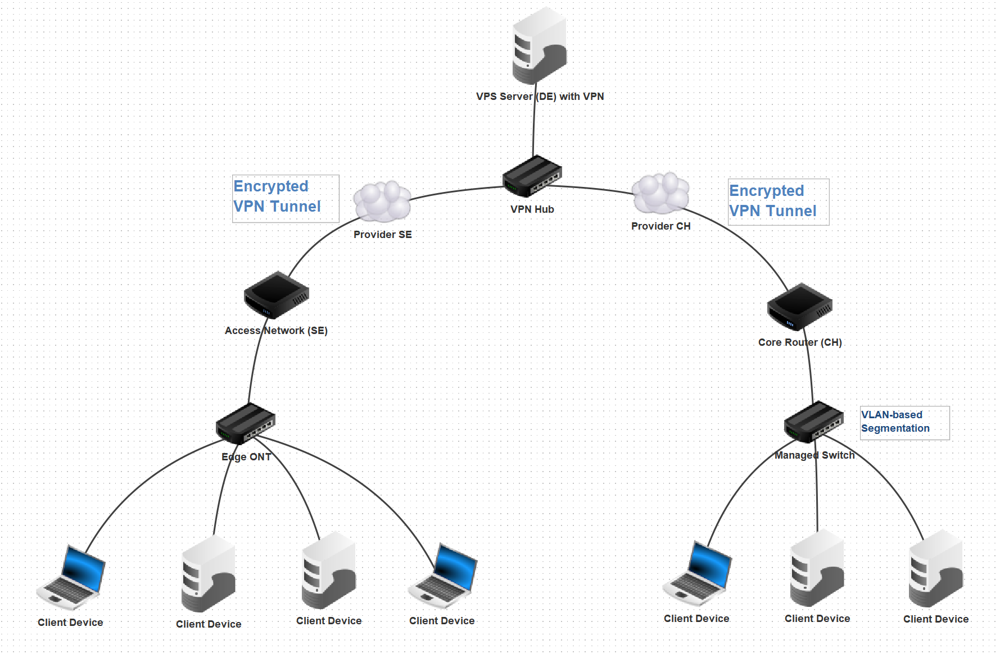

# ECN2026 – European Connected Network

## Overview
ECN2026 is a personal network engineering project simulating a multi-site
European network across Sweden, Switzerland and Germany.

The goal is to design, implement and document a realistic campus and backbone
architecture using limited hardware and enterprise-grade concepts.

## Sites
- Sweden (Access Site)
- Switzerland (Core / Campus Site)
- Germany (Cloud / VPS Backbone)

## Key Topics
- Routing & subnetting
- VLAN-based segmentation
- Site-to-site VPN (WireGuard)
- Firewalling & basic hardening
- Monitoring & logging concepts

## Repository Structure
ECN2026/
├── docs/        # Architecture, concepts, explanations
├── sites/       # Per-site documentation (SE / CH / DE)
├── configs/     # Sanitized configuration examples
├── diagrams/    # Network diagrams (PNG / SVG)
└── notes/       # Learning notes & observations

## Status
🚧 Work in progress (2026)

## Project Roadmap

**Phase 1 – Core Connectivity**
- Basic connectivity
- Routing fundamentals
- Baseline firewall rules

**Phase 2 – Segmentation & Multi-Site**
- VLAN-based segmentation
- Site-to-site VPN (WireGuard)
- Network isolation concepts

**Phase 3 – Security & Operations**
- Firewall hardening
- Monitoring & logging concepts
- Failover and resilience testing
## Network Overview Diagram

*This diagram is a simplified, abstract representation created for educational
and documentation purposes. It does not disclose real infrastructure details.*

*Diagram created using the Filius network simulator.*

## Disclaimer
This repository contains no real credentials, IP addresses or provider details.
All diagrams are simplified representations created using simulation tools.
They do not represent a production environment.
